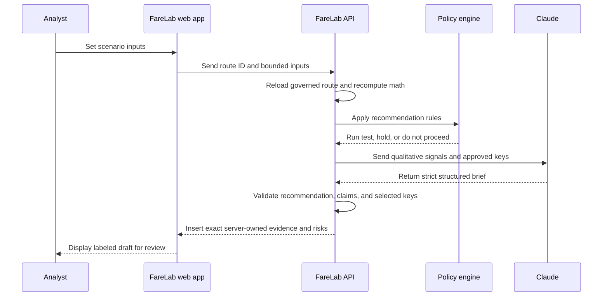

# FareLab

### U.S. Airline Pricing and Revenue Analytics

[Live application](https://giriworks.com/farelab/) | [GitHub repository](https://github.com/giridhar1103/AirFare_PricingAnalytics) | [Giridhar's portfolio](https://giriworks.com/)

data/image.png


FareLab is an interactive pricing analytics application built from public U.S. Department of Transportation data. It helps an analyst identify route-level review opportunities, inspect the supporting market evidence, test fare and capacity assumptions, and produce a governed decision brief.

The project combines analytical engineering, forecasting, econometrics, scenario mathematics, model governance, a React decision interface, and an optional AI communication layer. It is designed for U.S. pricing, revenue management analytics, and commercial analytics roles.

> **Decision question:** Which U.S. route and carrier markets deserve a yield, share, fare-position, or capacity review, and how does a proposed plan behave under explicit commercial assumptions?

FareLab is not presented as a production airline revenue management system. Public DOT data does not contain live inventory, booking curves, fare-class availability, bid prices, ancillary revenue, or route-level accounting cost. Those boundaries remain visible in the application and documentation.

## Project snapshot

| Area | Current production result |
| --- | --- |
| Source scale | More than 223 million staged DOT source rows |
| Analytical mart | 238,526 route-carrier-quarter records |
| Network coverage | 8,639 directional routes and 21 carriers |
| Historical range | 2017 Q1 through 2025 Q2 |
| Public workflow sample | 60 governed route-carrier examples |
| Forecast champion | Histogram gradient boosting |
| Forecast WAPE | 5.10% versus 15.40% seasonal naive |
| Forecast bias | 1.79% across 62,792 held-out observations |
| Forward interval coverage | 74.82% on the untouched 2025 H1 evaluation period |
| AI evaluation | 8 of 8 live cases passed |
| AI latency | 2.77 second median and 5.54 second p95 |

## Product outputs

- An evidence-ranked route opportunity queue
- A route and carrier market explorer
- A forecast and fare-response identification workbench
- An assumption-driven fare, capacity, competitor, and demand simulator
- A time-validated conditional passenger forecast with forward-tested intervals
- An optional unit-cost contribution scenario clearly separated from observed data
- A grounded AI decision brief with server-enforced recommendations and evidence
- A methodology workspace covering formulas, lineage, limitations, and model risk

## Application workspaces

| Workspace | Analyst task | Main output |
| --- | --- | --- |
| Pricing opportunities | Prioritize markets for review | Ranked actions with rationale, confidence, and score |
| Market explorer | Investigate one route and carrier | Fare, traffic, capacity, share, concentration, and competitor history |
| Model lab | Review forecast quality and identification | Time-based forecast metrics and rejected elasticity specifications |
| Scenario lab | Stress test a commercial plan | Passenger, revenue-proxy, load-factor, spill, and sensitivity outcomes |
| Methodology | Audit how the result was produced | Equations, data lineage, model controls, AI controls, and risk register |

## Architecture

```mermaid
flowchart LR
    A[DOT DB1B fares] --> C[Immutable source archives]
    B[DOT T-100 traffic and capacity] --> C
    C --> D[Validation and checksums]
    D --> E[DuckDB warehouse]
    E --> F[Version-controlled SQL transformations]
    F --> G[Route x carrier x quarter marts]
    G --> H[Econometrics and identification audit]
    G --> I[Time-validated demand forecast]
    H --> J[Governed model artifacts]
    I --> J
    J --> K[Browser-sized JSON release]
    K --> L[React and TypeScript application]
    L --> M[Interactive scenario]
    M --> N[FastAPI validation service]
    N --> O[Deterministic recommendation policy]
    O --> P[Claude structured decision brief]
```



The analytical product is static-first. Source ingestion, SQL transformations, econometric analysis, forecasting, and artifact generation run offline. The deployed web application reads a compact, versioned JSON artifact.

The AI decision brief uses a separate, isolated API. The browser sends a published route identifier and bounded scenario inputs. The API reloads the governed route record, recomputes the scenario with the canonical Python equations, applies a deterministic recommendation rule, and gives Claude only a qualitative narrative task.

### Component responsibilities

| Component | Technology | Responsibility |
| --- | --- | --- |
| Source ingestion | Python | Download official files, validate required fields, record checksums and source periods |
| Analytical storage | DuckDB | Store staged tables, intermediate joins, model marts, and source manifests |
| Transformation layer | SQL | Build reproducible route, carrier, traffic, fare, share, and quality measures |
| Econometrics | Python, `linearmodels` | Test fixed-effects and IV fare-response specifications |
| Forecasting | scikit-learn | Compare seasonal naive, ridge, and gradient-boosting forecasts out of time |
| Scenario engine | Python and TypeScript | Apply constant-elasticity, competitor-response, demand, and capacity equations |
| Decision interface | React, TypeScript, Recharts | Support route investigation, model review, scenario input, and visual explanation |
| Decision-brief API | FastAPI, Pydantic | Resolve the governed route, recompute outputs, enforce policy, and validate responses |
| Narrative provider | Anthropic Claude | Organize approved qualitative signals, evidence keys, risks, and a next step |
| Deployment | Cloudflare Pages, Nginx, systemd | Serve the static product and isolate the optional API behind HTTPS and rate limits |

## Data model

The core analytical grain is one directional route, operating carrier, and service quarter.

```text
route_id
carrier_code
period_key
weighted_fare_usd
competitor_weighted_fare_usd
t100_passengers
available_seats
load_factor
market_share
hhi
revenue_proxy
data_status
```

### Primary sources

- **DB1B Market:** historical quarterly 10% ticket sample through 2025 Q2
- **T-100 Domestic Segment:** reported monthly passengers, seats, carrier, and airport operations aggregated to quarter
- **DB1C:** retained as a separate monitoring layer because the monthly 40% sample beginning in July 2025 creates a different survey regime

The public artifact contains a curated 60-market workflow sample. It is designed to demonstrate every review action and is not presented as a statistically representative airline portfolio.

## Analytical methods

### Core measures

```text
weighted_fare = sum(fare x sampled_passengers) / sum(sampled_passengers)
load_factor = passengers / available_seats
revenue_proxy = weighted_fare x passengers
HHI = sum(carrier_market_share ^ 2)
fare_index = carrier_fare / competing_carrier_fare
```

Revenue proxy is not reported airline revenue or profit. It excludes optional-service revenue and can differ from accounting revenue because the fare and traffic sources use different collection designs.

### Fare-response identification

FareLab evaluated three specifications:

| Specification | Fare coefficient | Decision |
| --- | ---: | --- |
| Passenger fixed effects | +0.058 | Rejected for elasticity use |
| Market-share fixed effects | +0.028 | Rejected for elasticity use |
| Network-fare IV sensitivity | +0.021 | Research only |

All three estimates have a nonnegative sign, which is inconsistent with an identified downward-sloping demand response. Airlines change fares and capacity using commercial information that the public quarterly panel does not observe. FareLab reports this identification failure and does not force a plausible-looking negative elasticity.

Scenario elasticity therefore remains an explicit analyst assumption.

### Conditional passenger forecast

The forecasting task predicts next-quarter route-carrier passenger volume conditional on supplied fare, capacity, competitor fare, market structure, seasonal history, distance, and carrier.

Models evaluated:

- Same-quarter seasonal naive baseline
- Regularized linear regression
- Histogram gradient boosting regressor

Validation uses expanding time windows for 2023, 2024, and 2025 H1. The gradient-boosting champion achieved 5.10% aggregate WAPE and 1.79% bias. The seasonal naive baseline produced 15.40% WAPE.

The nominal 80% interval is calibrated on 50,463 observations from the 2023 and 2024 folds, then evaluated on 12,329 untouched observations from 2025 H1. Forward coverage is 74.82%. The application reports this calibration shortfall instead of evaluating the interval on the residuals used to create it.

### Scenario mathematics

Let the baseline fare and passengers be `P0` and `Q0`, own fare change be `dp`, competitor fare change be `dc`, analyst elasticity be `e`, governed cross-price elasticity be `ec`, and capacity change be `ds`.

```text
P1 = P0 x (1 + dp)
CompetitorP1 = CompetitorP0 x (1 + dc)
Q_demand = Q0 x (P1 / P0) ^ e x (CompetitorP1 / CompetitorP0) ^ ec
Seats1 = Seats0 x (1 + ds)
Q1 = min(Q_demand x demand_regime_factor, Seats1)
Revenue1 = P1 x Q1
LoadFactor1 = Q1 / Seats1
```

Inputs are bounded to feasible review ranges:

- Own fare change: -15% to +15%
- Capacity change: -20% to +20%
- Competitor fare change: -10% to +10%
- Demand regime: soft, base, or strong
- Own-price elasticity: explicit analyst assumption
- Unit cost: optional user-provided assumption

## Grounded AI decision brief

The AI feature is a controlled communication layer. It does not calculate the scenario, estimate elasticity, optimize a fare, or publish a commercial action.



### AI controls

- No free-form prompt is accepted from the browser
- No API key is shipped with the static application
- Claude receives no numerical scenario values
- Exact numbers are inserted only from server calculations
- The recommendation is owned by deterministic application code
- Output must match a strict Pydantic and tool schema
- Generated prose cannot contain quantitative, profit, certainty, causal, or optimization claims
- Invalid output is retried once and then fails closed
- A provider failure does not affect the scenario calculation
- Every brief is labeled as AI-generated and requires analyst review

### Recommendation policy

| Scenario condition | Enforced review outcome |
| --- | --- |
| Proposed fare is outside supported fare history | Do not proceed |
| Revenue proxy declines by at least 0.5% | Do not proceed |
| Seat constraint binds | Hold for review |
| Absolute revenue-proxy movement is below 0.5% | Hold for review |
| Supported scenario clears the controls | Run controlled test |

### AI evaluation

The live evaluation set covers a supported increase, neutral result, negative revenue proxy, fare extrapolation, capacity constraint, competitor movement, soft demand, and optional analyst cost.

Release result:

- 8 of 8 live cases passed
- 100% recommendation-policy agreement
- 100% grounded evidence and risk selection
- Zero prohibited generated claims
- 2.77 second median response time
- 5.54 second p95 response time

The committed evaluation result contains validation outcomes and latency only. Generated prose is not stored in the repository.

## Repository structure

```text
AirFare_PricingAnalytics/
|
|-- api/                    FastAPI endpoint and grounded brief policy
|-- config/                 Project and source configuration
|-- data/
|   |-- raw/                Immutable local source archives, ignored by Git
|   |-- interim/            Extracted and normalized local files
|   |-- processed/          Local DuckDB warehouse
|   `-- manifests/          Source checksums, periods, rows, and build metadata
|-- deploy/                 systemd and Nginx deployment definitions
|-- docs/                   Methodology, contracts, research, and deployment notes
|-- evals/                  AI cases, runner, and aggregate release result
|-- models/                 Versioned model cards and local trained bundles
|-- pipeline/farelab/       Ingestion, warehouse, modeling, scenario, and export code
|-- sql/
|   |-- staging/            Source normalization
|   |-- intermediate/       Cross-source joins and calculated measures
|   |-- marts/              Route and carrier analytical tables
|   `-- tests/              SQL quality audits
|-- tests/                  Python model, contract, release, and policy tests
`-- web/                    Vite, React, TypeScript, Recharts, and Playwright
```

## Quality and testing

The release currently passes:

- 34 Python model, contract, repository, and release tests
- 15 desktop and mobile browser tests
- Automated WCAG A and AA checks across all five workspaces
- Nested-route refresh validation
- Scenario parity and boundary tests
- Artifact schema, size, source-vintage, and action-coverage checks
- Eight deterministic and live AI evaluation cases
- A checksummed 19-file static release manifest

The repository policy also prevents em and en dashes from entering the deployed FareLab source or public artifact.

## Local development

Requirements:

- Node.js 18 or later
- Python 3.11 or later
- DuckDB 1.4 or later

Install and run the web application:

```bash
make web-install
make web-dev
```

Run Python tests:

```bash
python3 -m unittest discover -s tests -v
```

Build and run the browser suite:

```bash
cd web
npx playwright install chromium
npm run build
npm run test:e2e
```

Run the API locally after providing `ANTHROPIC_API_KEY` through the environment:

```bash
python3 -m venv .venv-api
.venv-api/bin/pip install 'anthropic>=0.97,<1' 'fastapi>=0.116,<1' \
  'pydantic>=2.11,<3' 'uvicorn[standard]>=0.35,<1'
.venv-api/bin/uvicorn api.app:app --host 127.0.0.1 --port 8010
```

Run deterministic AI evaluations:

```bash
.venv-api/bin/python evals/run_ai_evals.py
```

## Full analytical rebuild

After the official source archives are available locally:

```bash
make warehouse
make elasticity
make market-share
make iv-sensitivity
make forecast
make export
make check
```

Build the verified static release:

```bash
make release-bundle
```

## Deployment

The static application is hosted at [giriworks.com/farelab](https://giriworks.com/farelab/) through the existing portfolio Cloudflare Pages build.

The optional decision-brief API runs as an isolated FastAPI service behind Nginx at `api.giriworks.com/farelab-ai/`. It binds to a dedicated loopback port, reads its secret from a protected server environment file, and uses existing HTTPS and rate-limit controls.

See [deployment.md](docs/deployment.md) for the complete integration, verification, and rollback contract.

## Documentation

- [Methodology and equations](docs/methodology.md)
- [Data contract](docs/data-contract.md)
- [AI grounding and evaluation](docs/ai-decision-brief.md)
- [Production data audit](docs/research/production-data-audit.md)
- [Fare-response identification audit](docs/research/identification-audit.md)
- [Pricing role alignment](docs/research/pricing-role-alignment.md)
- [Claim and source ledger](docs/research/claim-source-ledger.md)
- [Deployment contract](docs/deployment.md)

## Known limitations

- Public DOT data is quarterly and delayed
- DB1B fares are sampled ticket records rather than live offered fares
- The product does not observe booking curves, search demand, or fare-class inventory
- No route-level cost or ancillary-revenue source is included
- Historical revenue is a transparent proxy, not reported accounting revenue
- Fare-response coefficients did not pass identification checks and are not used as elasticity
- The scenario uses an analyst-owned elasticity and a governed cross-price assumption
- Forecast intervals under-covered the nominal level on the forward 2025 H1 period
- The AI evaluation set is small and does not represent internal airline decision records
- The application cannot file fares, change inventory, or replace commercial approval

## License and attribution

Application code is released under the [MIT License](LICENSE). Source data remains subject to the definitions and terms published by the U.S. Bureau of Transportation Statistics.

Designed and built by [Giridhar Achuthananda](https://giriworks.com/).
